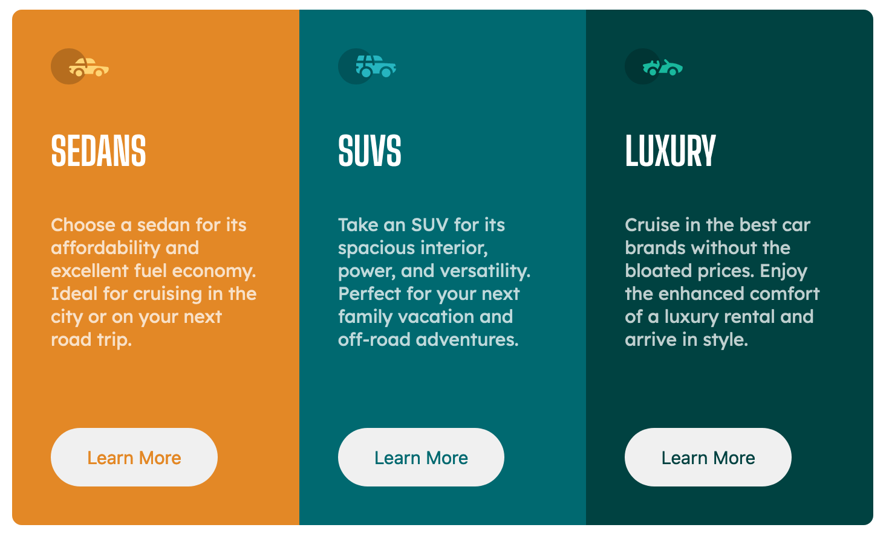

# Frontend Mentor 3-column preview card component solution

This is a solution to the [3-column preview card component challenge on Frontend Mentor](https://www.frontendmentor.io/challenges/3column-preview-card-component-pH92eAR2-). Frontend Mentor challenges help me improve my coding skills by building realistic projects.

## Table of contents

- [Overview](#overview)
  - [The challenge](#the-challenge)
  - [Screenshot](#screenshot)
  - [Links](#links)
- [My process](#my-process)
  - [Built with](#built-with)
  - [Useful resources](#useful-resources)
- [Author](#author)

## Overview

### The challenge

Users should be able to:

- View the optimal layout depending on their device's screen size.
- See hover states for interactive elements.

### Screenshot

### Links

- Solution URL: [Solution](https://www.frontendmentor.io/solutions/responsive-card-layout-using-flex-box-KlSecgd0E)
- Live Site URL: [Demo](https://c60pb.csb.app/)

## My process

### Built with

- Semantic HTML5 markup
- CSS custom properties
- Flexbox
- CSS Grid
- Mobile-first workflow

### Useful resources

- [MDN](https://developer.mozilla.org/en-US/) - This is my source-of-truch resource for web development.
- [CSS Tricks](https://css-tricks.com/) - This is an amazing website which helped me finally understand the difference between **Flexbox** and **Grid** layouts. I'd recommend it to anyone still learning this concept.

## Author

- Website - [Menai Ala Eddine](https://www.your-site.com)
- Frontend Mentor - [Menai Ala](https://www.frontendmentor.io/profile/MenaiAla)
- Stackoverflow - [Menai Ala Eddine](https://stackoverflow.com/users/7551963/menai-ala-eddine-aladdin)
